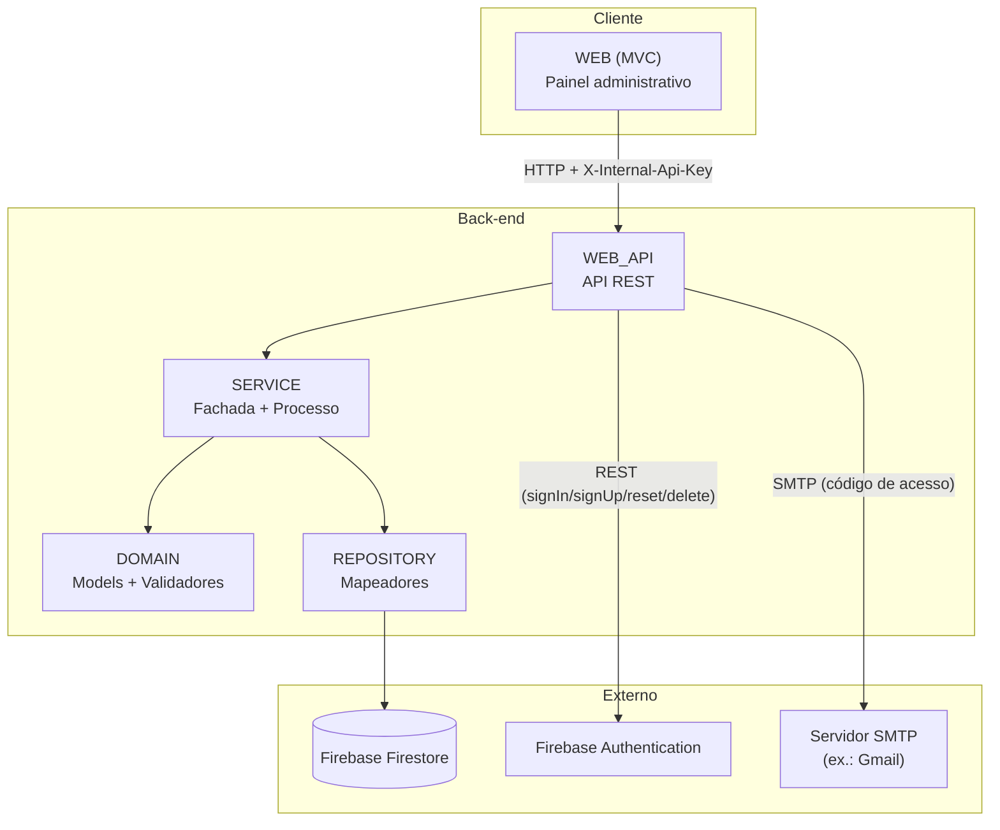

# IValid

Sistema de gestão de validade de produtos para supermercados, com o objetivo de reduzir o desperdício de alimentos ao identificar automaticamente produtos próximos do vencimento e sugerir descontos progressivos para incentivar sua venda.

Este documento descreve a visão geral do sistema e sua arquitetura técnica.

## Sumário

- [Visão geral](#visão-geral)
- [Stack tecnológica](#stack-tecnológica)
- [Arquitetura](#arquitetura)
- [Camadas do sistema](#camadas-do-sistema)
- [Comunicação entre WEB e WEB_API](#comunicação-entre-web-e-web_api)
- [Multi-tenancy: um login por supermercado](#multi-tenancy-um-login-por-supermercado)
- [Autenticação e segurança](#autenticação-e-segurança)
- [Modelo de dados (Firestore)](#modelo-de-dados-firestore)
- [Estrutura de pastas](#estrutura-de-pastas)

## Visão geral

O IValid é um painel administrativo web multi-tenant voltado para supermercados: cada supermercado cadastrado tem seus próprios produtos, funcionários e configurações, completamente isolados dos demais. O sistema permite cadastrar produtos com preço, quantidade em estoque e data de vencimento, e calcula automaticamente:

- o status de validade do produto (crítico, em atenção, na validade ou vencido);
- o percentual de desconto sugerido para cada status;
- o preço promocional resultante.

Esses limiares (quantos dias antes do vencimento cada status começa) e os percentuais de desconto de cada faixa são configuráveis pelo próprio administrador, na tela de Configurações — não são valores fixos no código, e cada supermercado tem a sua própria configuração.

Na listagem de produtos, itens sem estoque são sempre exibidos por último, independentemente do status de validade — afinal, não há mais o que vender. Produtos vencidos seguem a mesma lógica de "vão para o final" dentro do grupo de itens que ainda têm estoque.

O projeto é acadêmico e, por decisão de escopo, cobre apenas a parte web (painel administrativo e API). Um aplicativo mobile em Kotlin está previsto na concepção original do sistema, mas está fora do escopo desta implementação.

## Stack tecnológica

| Camada | Tecnologia |
|---|---|
| Front-end / painel administrativo | ASP.NET Core MVC (C#) |
| API | ASP.NET Core Web API (C#) |
| Banco de dados | Firebase Firestore (NoSQL) |
| Autenticação do administrador | Firebase Authentication (via API REST) |
| Autenticação de funcionários | Hash de senha local (PBKDF2-SHA256), sem Firebase |
| Sessão do painel | Cookie Authentication (ASP.NET Core) |
| Envio de e-mail | SMTP (`System.Net.Mail`), ex.: Gmail |
| Validação de regras de negócio | FluentValidation |
| Documentação interativa da API | Scalar (OpenAPI) |

## Arquitetura

O sistema segue uma arquitetura em camadas, com responsabilidades bem separadas entre cadastro/validação de dados, regras de negócio e exposição via API/interface web.



A `WEB` nunca acessa o Firestore, o Firebase Authentication ou a lógica de negócio diretamente — toda operação, incluindo login, cadastro e recuperação de senha, passa pela `WEB_API`, que por sua vez delega para as camadas internas (`SERVICE`, `DOMAIN`, `REPOSITORY`) ou conversa com os serviços externos (Firebase Authentication, SMTP). Essa separação permite, por exemplo, que a mesma API venha a ser consumida futuramente por um aplicativo mobile, sem duplicar regra de negócio.

## Camadas do sistema

**DOMAIN** — projeto central de domínio, sem dependência de infraestrutura. Contém os `Models` (entidades como `ProdutoModel`, `ConfiguracaoModel`, `UsuarioModel`, `SupermercadoModel`, `FuncionarioModel`) e os `Validadores`, escritos com FluentValidation, que definem as regras de negócio de cada entidade (ex.: nome obrigatório, preço maior que zero, data de vencimento não pode estar no passado). Todo validador herda de uma classe abstrata comum (`ValidadorAbstrato<T>`), que padroniza os métodos de inclusão, atualização e exclusão.

**Excecoes** — projeto compartilhado com os tipos de exceção usados em todo o sistema (`IValidExcecao`, `CodigoExcecao`, `ExcecaoDetalhes`), garantindo que erros de negócio sejam tratados de forma consistente entre a API e o painel.

**REPOSITORY** — camada de acesso a dados. Cada entidade tem um `Mapeador` (ex.: `ProdutoMapeador`, `ConfiguracaoMapeador`, `SupermercadoMapeador`, `FuncionarioMapeador`) responsável por ler e escrever diretamente no Firestore, implementando uma interface própria (ex.: `IProdutoMapeador`). Nenhuma outra camada acessa o Firestore diretamente.

**SERVICE** — camada de regra de negócio, dividida em dois papéis:
- `Processo`: lógica de negócio propriamente dita. Exemplos: `ProdutoProcesso` calcula o status de validade, o percentual de desconto e o preço promocional de cada produto, e ordena a listagem colocando primeiro os itens com estoque (do mais urgente ao menos urgente) e, por último, os sem estoque e os vencidos; `SupermercadoProcesso` gera o código de acesso único de cada loja; `FuncionarioProcesso` faz o hash e a verificação de senha dos funcionários; `EmailProcesso` envia o e-mail com o código de acesso via SMTP.
- `Fachada`: orquestra `Processo` e `Validador` juntos, garantindo que nenhuma operação de cadastro/atualização/exclusão seja executada sem antes passar pela validação de domínio. A `UsuarioFachada`, por exemplo, orquestra a criação do Supermercado, do Administrador e o envio do e-mail com o código de acesso em uma única operação de registro.

**WEB_API** — API REST que expõe as operações do sistema (`api/Produto`, `api/Configuracao`, `api/Usuario`, `api/Pedido`, `api/Funcionario`). É protegida por um middleware de chave interna (`X-Internal-Api-Key`), já que seu uso é restrito à `WEB` — não é uma API pública. É também a única camada que conversa com o Firebase Authentication e com o servidor SMTP.

**WEB** — painel administrativo (MVC), consumido pelo usuário final (administrador ou funcionário do supermercado). Não contém regra de negócio: cada ação do painel monta a requisição e delega para a `WEB_API`, tratando a resposta (sucesso, erro de validação, erro de conexão) para exibir ao usuário. O acesso às telas é restrito por perfil (`[Authorize(Roles = "...")]`): Produtos é liberado para Administrador, Gerente e Operador de Estoque; Pedidos para Administrador, Gerente e Atendente; Configurações e a gestão de Funcionários ficam restritas ao Administrador.

## Comunicação entre WEB e WEB_API

A `WEB` se comunica com a `WEB_API` exclusivamente via HTTP, usando um `HttpClient` nomeado (`IValidApi`) configurado com a URL base da API e um cabeçalho fixo de autenticação interna (`X-Internal-Api-Key`). A `WEB_API` valida esse cabeçalho em um middleware antes de processar qualquer requisição (exceto as rotas de documentação do Scalar/OpenAPI), rejeitando com `401` qualquer chamada sem a chave correta.

Esse mecanismo existe porque a `WEB_API` não foi desenhada para ser pública: ela é de uso exclusivo do próprio sistema (hoje, só a `WEB`; no futuro, potencialmente também um app mobile).

Como o sistema é multi-tenant, praticamente toda chamada da `WEB` para a `WEB_API` sobre produtos, pedidos, configurações e funcionários inclui o `supermercadoId` do usuário logado como query string, extraído da claim `SupermercadoId` do cookie de autenticação. A `WEB_API` usa esse valor para filtrar e validar a posse de cada recurso antes de retorná-lo ou alterá-lo.

## Multi-tenancy: um login por supermercado

Cada supermercado cadastrado é um tenant isolado, identificado por um **Código de Acesso** único (gerado automaticamente a partir do nome da loja no momento do cadastro, com um sufixo numérico caso já exista outro igual). Um mesmo proprietário com duas lojas físicas cria duas contas distintas — uma por supermercado — cada uma com seu próprio código.

O login é feito em duas etapas, na mesma tela:

1. O usuário informa o **Código da Loja**.
2. O sistema busca os usuários daquela loja (o Administrador dono da conta e os Funcionários ativos) e exibe um seletor; o usuário escolhe seu nome e informa a senha.

Internamente, os dois tipos de usuário são autenticados de formas diferentes, mas convergem para o mesmo resultado (um DTO `ResultadoLoginModel` com nome, perfil e `supermercadoId`), usado para montar as claims do cookie de sessão:

- **Administrador**: autenticado contra o Firebase Authentication (email/senha), como antes. O e-mail correspondente é resolvido a partir do `usuarioId` selecionado, sem que o usuário precise digitá-lo.
- **Funcionário**: autenticado contra um hash de senha (PBKDF2-SHA256) armazenado no próprio Firestore, sem envolver o Firebase Authentication. Funcionários são cadastrados pelo Administrador, com um perfil pré-definido: Gerente, Operador de Estoque ou Atendente.

Isolamento de dados entre lojas:

- `ProdutoModel`, `ConfiguracaoModel`, `UsuarioModel` e `FuncionarioModel` carregam um `SupermercadoId`, usado para filtrar e validar posse em toda operação de leitura/escrita.
- `ConfiguracaoModel` deixou de ser um documento único global (`geral`) e passou a ser um documento por `SupermercadoId` — cada loja tem seus próprios limiares de dias e percentuais de desconto.
- `PedidoModel` é escrito diretamente pelo aplicativo mobile (fora do escopo desta implementação) e não carrega `SupermercadoId`. Por isso, o isolamento de Pedidos é feito de forma indireta: a API busca os Produtos do supermercado do usuário logado, monta o conjunto de IDs desses produtos, e filtra os Pedidos cujos itens fazem referência a algum desses IDs.

## Autenticação e segurança

O acesso ao painel administrativo é protegido em duas frentes:

- **Sessão do painel**: após o login, a `WEB` mantém a sessão do usuário via cookie de autenticação do ASP.NET Core, configurado com `HttpOnly`, `SecurePolicy = Always` e `SameSite = Strict`. Um filtro global de autorização exige login em todas as páginas do painel, com exceção explícita das telas de login, cadastro e recuperação de senha. Dentro do painel, o acesso a cada tela é restrito por perfil (`ClaimTypes.Role`), como descrito na seção de camadas.
- **Identidade do usuário**: para Administradores, a validação de credenciais é feita contra o Firebase Authentication. Para Funcionários, contra um hash local (PBKDF2-SHA256, com `CryptographicOperations.FixedTimeEquals` na comparação).

O cadastro não exige mais um código de convite: qualquer pessoa pode se cadastrar, criando ao mesmo tempo sua conta de Administrador e o Supermercado (com nome, CNPJ e endereço). Ao final do cadastro, o Código de Acesso da loja é enviado por e-mail — não é exibido na tela — e é ele que identifica a loja em todo login futuro. Caso a criação dos dados no Firestore falhe depois que a conta já foi criada no Firebase Authentication, a API reverte (exclui) automaticamente a conta órfã, evitando que o e-mail fique bloqueado para novas tentativas de cadastro.

Segredos (chave de API interna, credencial de acesso ao Firebase, credenciais de e-mail SMTP) ficam fora do controle de versão, em arquivos de configuração locais (`appsettings.Development.json` e a pasta `Chave/`), listados no `.gitignore`.

## Modelo de dados (Firestore)

O Firestore é usado como banco de dados NoSQL, com as seguintes coleções principais:

- **supermercados** — um documento por loja cadastrada (nome, CNPJ, endereço, código de acesso único). É o tenant do sistema.
- **produtos** — um documento por produto cadastrado (nome, preço, quantidade, data de vencimento, status calculado, percentual de desconto, preço promocional, imagem, `supermercadoId`).
- **users** — um documento por Administrador cadastrado, com `supermercadoId` vinculando-o à sua loja.
- **funcionarios** — um documento por funcionário cadastrado por um Administrador, com nome, hash de senha, perfil (Gerente/Operador de Estoque/Atendente), situação (ativo/inativo) e `supermercadoId`.
- **configuracoes** — um documento por `supermercadoId`, guardando os limiares de dias e os percentuais de desconto usados no cálculo de status dos produtos daquela loja especificamente.
- **pedidos** — escrita pelo aplicativo mobile (fora do escopo desta implementação); não possui `supermercadoId` — sua associação a uma loja é feita indiretamente através dos produtos referenciados em seus itens.

## Estrutura de pastas

```
IValid/
├── DOMAIN/           # Models e Validadores (regras de negócio de domínio)
├── Excecoes/         # Tipos de exceção compartilhados
├── REPOSITORY/       # Mapeadores de acesso ao Firestore
├── SERVICE/          # Processo (lógica de negócio) e Fachada (orquestração + validação)
├── WEB_API/          # API REST, consumida pela WEB
├── WEB/              # Painel administrativo (MVC)
└── Chave/            # Credencial do Firebase (fora do controle de versão)
```
