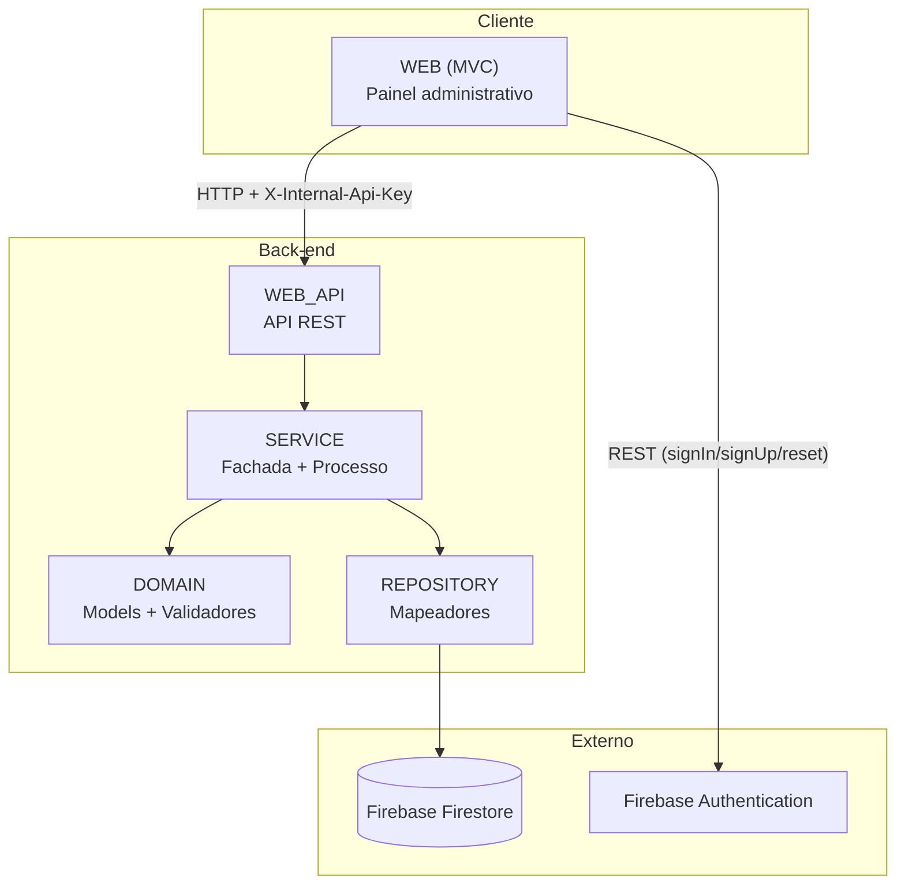

# IValid

Sistema de gestão de validade de produtos para supermercados, com o objetivo de reduzir o desperdício de alimentos ao identificar automaticamente produtos próximos do vencimento e sugerir descontos progressivos para incentivar sua venda.

Este documento descreve a visão geral do sistema e sua arquitetura técnica.

## Sumário

- [Visão geral](#visão-geral)
- [Stack tecnológica](#stack-tecnológica)
- [Arquitetura](#arquitetura)
- [Camadas do sistema](#camadas-do-sistema)
- [Comunicação entre WEB e WEB_API](#comunicação-entre-web-e-web_api)
- [Autenticação e segurança](#autenticação-e-segurança)
- [Modelo de dados (Firestore)](#modelo-de-dados-firestore)
- [Estrutura de pastas](#estrutura-de-pastas)

## Visão geral

O IValid é um painel administrativo web voltado para supermercados. Ele permite cadastrar produtos com preço, quantidade em estoque e data de vencimento, e o sistema calcula automaticamente:

- o status de validade do produto (crítico, em atenção, na validade ou vencido);
- o percentual de desconto sugerido para cada status;
- o preço promocional resultante.

Esses limiares (quantos dias antes do vencimento cada status começa) e os percentuais de desconto de cada faixa são configuráveis pelo próprio administrador, na tela de Configurações — não são valores fixos no código.

O projeto é acadêmico e, por decisão de escopo, cobre apenas a parte web (painel administrativo e API). Um aplicativo mobile em Kotlin está previsto na concepção original do sistema, mas está fora do escopo desta implementação.

## Stack tecnológica

| Camada | Tecnologia |
|---|---|
| Front-end / painel administrativo | ASP.NET Core MVC (C#) |
| API | ASP.NET Core Web API (C#) |
| Banco de dados | Firebase Firestore (NoSQL) |
| Autenticação de usuários | Firebase Authentication (via API REST) |
| Sessão do painel | Cookie Authentication (ASP.NET Core) |
| Validação de regras de negócio | FluentValidation |
| Documentação interativa da API | Scalar (OpenAPI) |

## Arquitetura

O sistema segue uma arquitetura em camadas, com responsabilidades bem separadas entre cadastro/validação de dados, regras de negócio e exposição via API/interface web.



A `WEB` nunca acessa o Firestore ou a lógica de negócio diretamente — toda operação sobre produtos, configurações e usuários passa pela `WEB_API`, que por sua vez delega para as camadas internas (`SERVICE`, `DOMAIN`, `REPOSITORY`). Essa separação permite, por exemplo, que a mesma API venha a ser consumida futuramente por um aplicativo mobile, sem duplicar regra de negócio.

A autenticação de usuário (login, cadastro, redefinição de senha) é a única operação em que a `WEB` conversa diretamente com um serviço externo — o Firebase Authentication — em vez de passar pela `WEB_API`.

## Camadas do sistema

**DOMAIN** — projeto central de domínio, sem dependência de infraestrutura. Contém os `Models` (entidades como `ProdutoModel`, `ConfiguracaoModel`, `UsuarioModel`) e os `Validadores`, escritos com FluentValidation, que definem as regras de negócio de cada entidade (ex.: nome obrigatório, preço maior que zero, data de vencimento não pode estar no passado). Todo validador herda de uma classe abstrata comum (`ValidadorAbstrato<T>`), que padroniza os métodos de inclusão, atualização e exclusão.

**Excecoes** — projeto compartilhado com os tipos de exceção usados em todo o sistema (`IValidExcecao`, `CodigoExcecao`, `ExcecaoDetalhes`), garantindo que erros de negócio sejam tratados de forma consistente entre a API e o painel.

**REPOSITORY** — camada de acesso a dados. Cada entidade tem um `Mapeador` (ex.: `ProdutoMapeador`, `ConfiguracaoMapeador`) responsável por ler e escrever diretamente no Firestore, implementando uma interface própria (ex.: `IProdutoMapeador`). Nenhuma outra camada acessa o Firestore diretamente.

**SERVICE** — camada de regra de negócio, dividida em dois papéis:
- `Processo`: lógica de negócio propriamente dita (ex.: `ProdutoProcesso` calcula o status de validade, o percentual de desconto e o preço promocional de cada produto, e ordena a listagem colocando os vencidos por último).
- `Fachada`: orquestra `Processo` e `Validador` juntos, garantindo que nenhuma operação de cadastro/atualização/exclusão seja executada sem antes passar pela validação de domínio.

**WEB_API** — API REST que expõe as operações do sistema (`api/Produto`, `api/Configuracao`, `api/Usuario`). É protegida por um middleware de chave interna (`X-Internal-Api-Key`), já que seu uso é restrito à `WEB` — não é uma API pública.

**WEB** — painel administrativo (MVC), consumido pelo usuário final (administrador do supermercado). Não contém regra de negócio: cada ação do painel monta a requisição e delega para a `WEB_API`, tratando a resposta (sucesso, erro de validação, erro de conexão) para exibir ao usuário.

## Comunicação entre WEB e WEB_API

A `WEB` se comunica com a `WEB_API` exclusivamente via HTTP, usando um `HttpClient` nomeado (`IValidApi`) configurado com a URL base da API e um cabeçalho fixo de autenticação interna (`X-Internal-Api-Key`). A `WEB_API` valida esse cabeçalho em um middleware antes de processar qualquer requisição (exceto as rotas de documentação do Scalar/OpenAPI), rejeitando com `401` qualquer chamada sem a chave correta.

Esse mecanismo existe porque a `WEB_API` não foi desenhada para ser pública: ela é de uso exclusivo do próprio sistema (hoje, só a `WEB`; no futuro, potencialmente também um app mobile).

## Autenticação e segurança

O acesso ao painel administrativo é protegido em duas frentes:

- **Sessão do painel**: após o login, a `WEB` mantém a sessão do usuário via cookie de autenticação do ASP.NET Core, configurado com `HttpOnly`, `SecurePolicy = Always` e `SameSite = Strict`. Um filtro global de autorização exige login em todas as páginas do painel, com exceção explícita das telas de login, cadastro e recuperação de senha.
- **Identidade do usuário**: a validação de credenciais (email/senha) é feita contra o Firebase Authentication, via chamadas REST diretas da `WEB` (login, cadastro e envio de email de redefinição de senha).

O cadastro de novos administradores exige um código de convite, validado contra um valor configurado no servidor — não é um cadastro aberto ao público. Esse modelo é o ponto de partida atual; substituí-lo por um fluxo em que um administrador já logado cria novos usuários com papel definido é uma evolução considerada para o futuro do projeto.

Segredos (chave de API interna, código de convite, credencial de acesso ao Firebase) ficam fora do controle de versão, em arquivos de configuração locais (`appsettings.Development.json` e a pasta `Chave/`), listados no `.gitignore`.

## Modelo de dados (Firestore)

O Firestore é usado como banco de dados NoSQL, com as seguintes coleções principais:

- **produtos** — um documento por produto cadastrado (nome, preço, quantidade, data de vencimento, status calculado, percentual de desconto, preço promocional, imagem).
- **usuarios** — um documento por administrador cadastrado no painel.
- **configuracoes** — coleção com um único documento (`geral`), guardando os limiares de dias e os percentuais de desconto usados no cálculo de status dos produtos. Esse é o padrão de "documento único" (singleton), usado quando a configuração é global ao sistema, e não uma lista de registros.

## Estrutura de pastas

```
IValid/
├── DOMAIN/           # Models e Validadores (regras de negócio de domínio)
├── Excecoes/         # Tipos de exceção compartilhados
├── REPOSITORY/       # Mapeadores de acesso ao Firestore
├── SERVICE/          # Processo (lógica de negócio) e Fachada (orquestração + validação)
├── WEB_API/          # API REST, consumida pela WEB
├── WEB/              # Painel administrativo (MVC)
└── Chave/            # Credencial do Firebase (fora do controle de versão)
```
